<p align="center">
  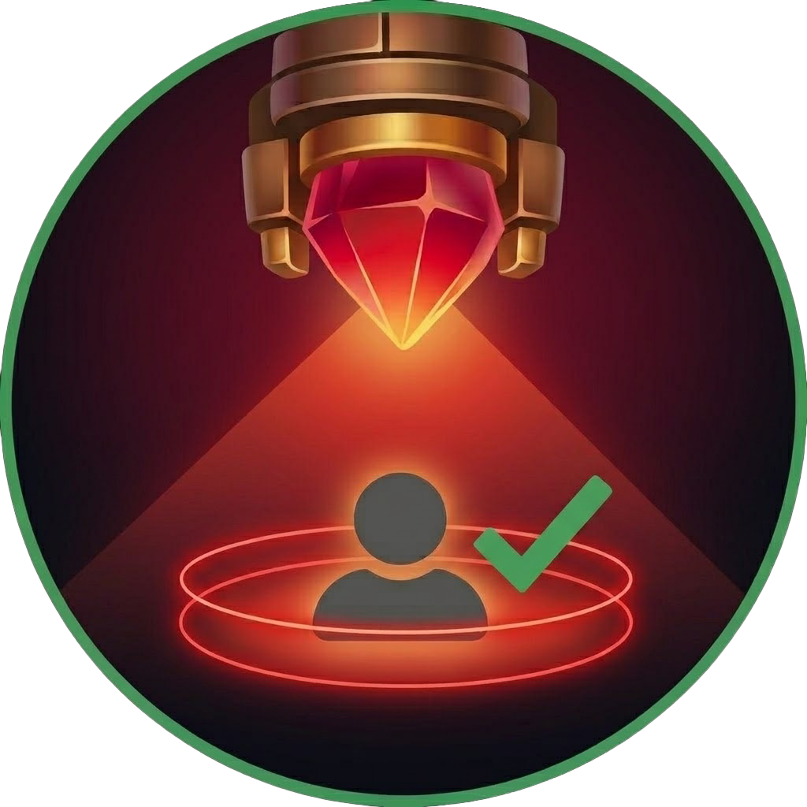
</p>

<h1 align="center">Oracle Lens</h1>

<p align="center">
  A desktop app that reads your own League of Legends account from the local game client
  and lays the whole collection out in one place.
</p>

---

## What it does

The League client shows your champions, skins, chromas, wards, emotes and loot across a
dozen different screens, and never all at once. Oracle Lens connects to the client
already running on your machine, pulls everything through the local LCU API, and puts
it in a single browsable, searchable, exportable view.

No login, no "Connect" button. Open the client, open Oracle Lens, and it finds it.

## Security and scope

This matters more than the feature list, so it goes first:

- **Local only.** The app talks to the League client on *your* machine, authenticating
  through the client's own lockfile — the same mechanism the client uses internally.
- **No credentials.** It never asks for, transmits, or stores a Riot password or token.
- **Read only.** It reads data. It does not automate gameplay, accept queues, pick or
  ban, or take any action in the client.
- **Your account only.** There is no way to point it at someone else's account, and no
  feature is planned that would.
- **No valuation.** It does not estimate what an account is worth and does not touch
  account-marketplace data.

Locally stored data is limited to cached game art, your display preferences, and
snapshots of accounts you've already viewed — display data only, never credentials.

## Screenshots

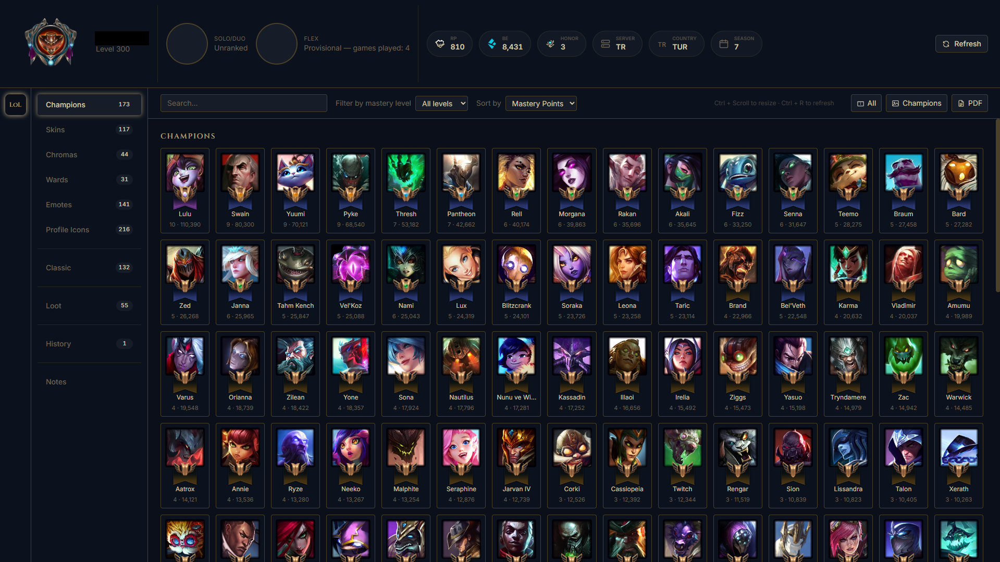

<details>
<summary><b>More screenshots</b></summary>

### Skins
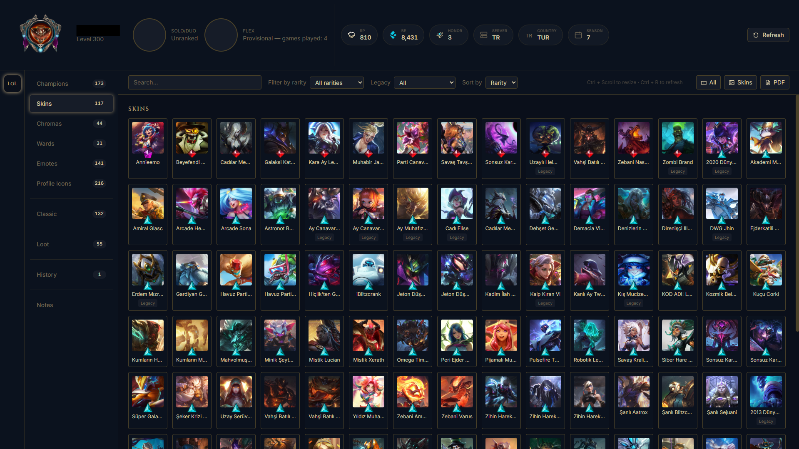

### Chromas
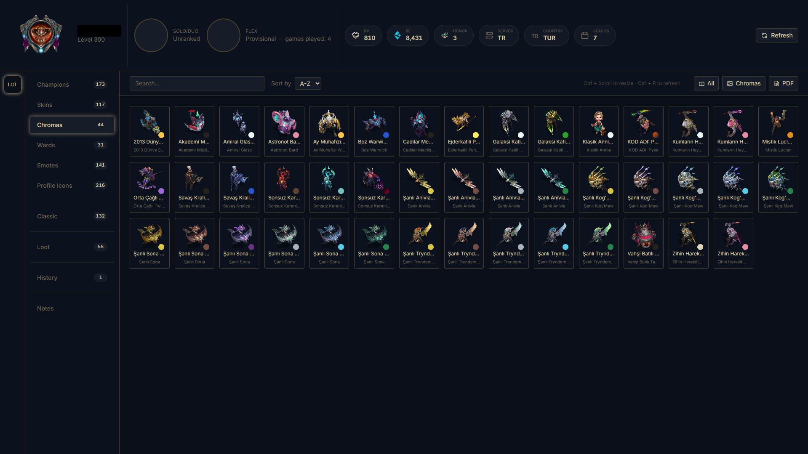

### Wards
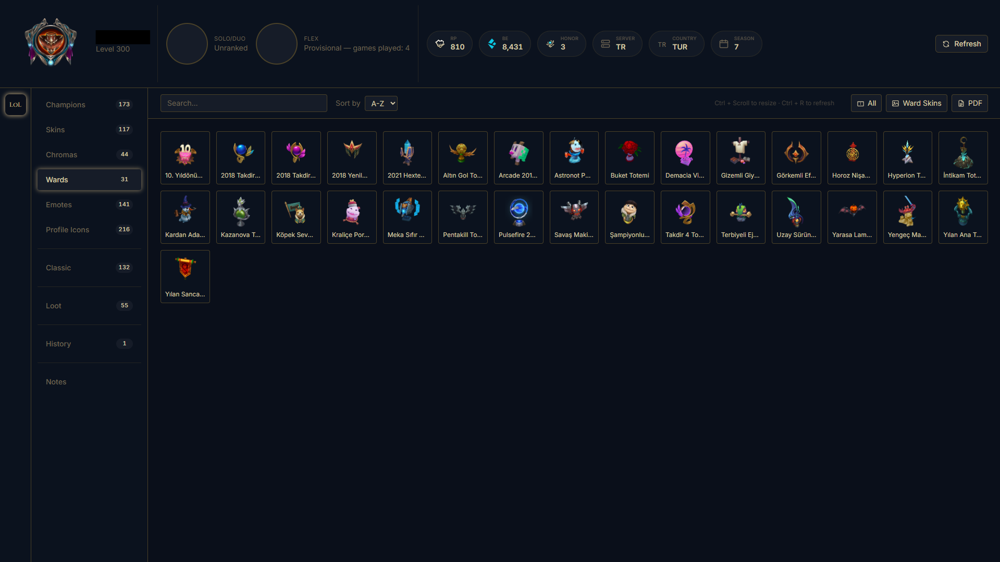

### Emotes
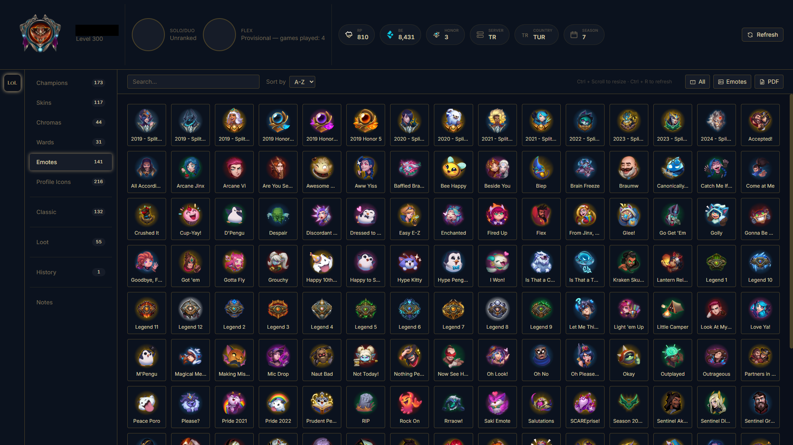

### Profile icons
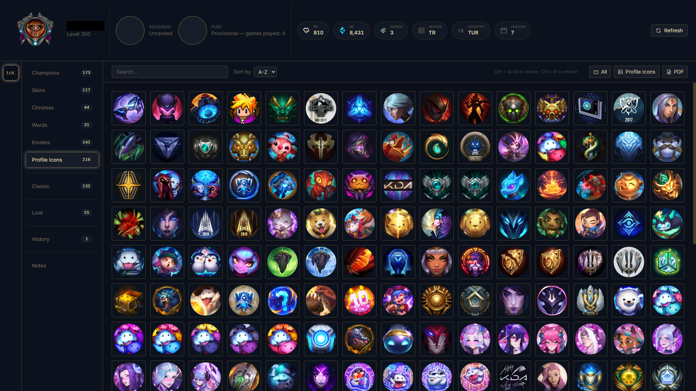

### Classic
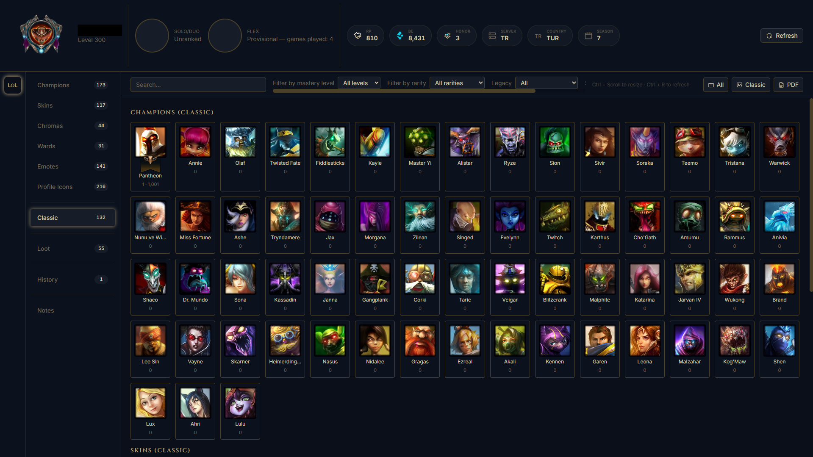

### Loot
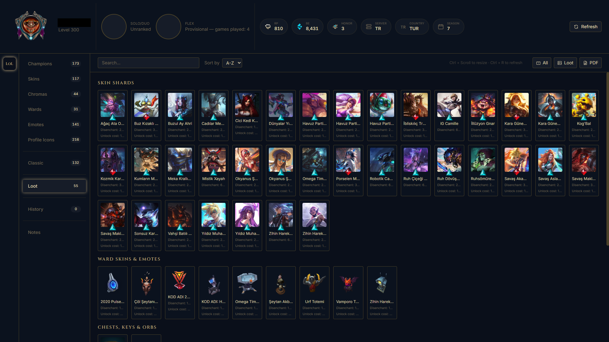

### History
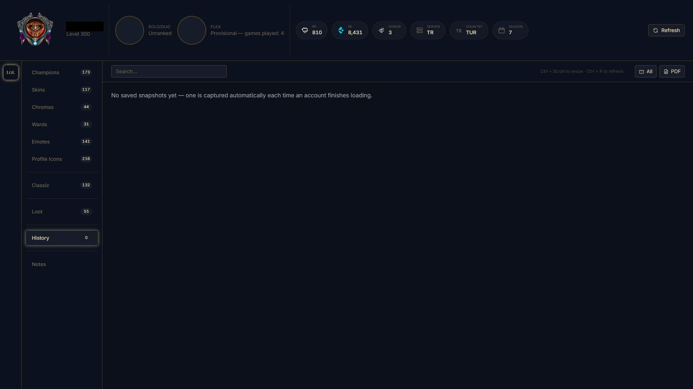

### Notes
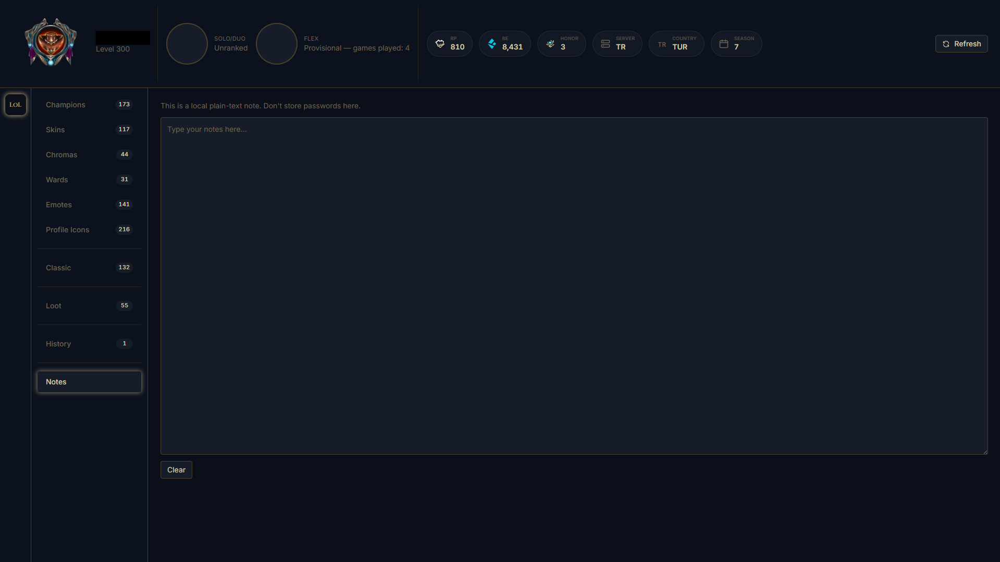

### Waiting for the client
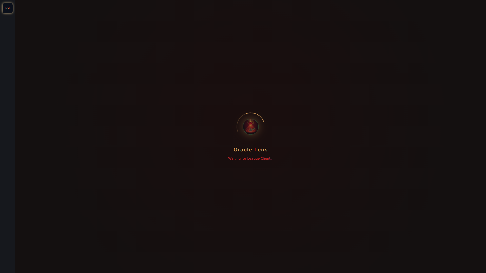

### Connecting to the client
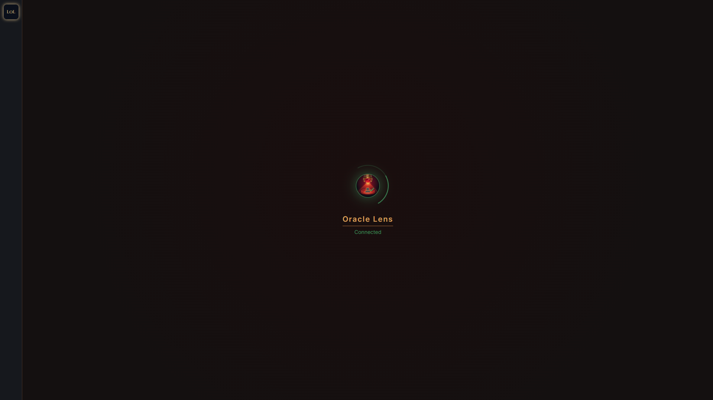

</details>

## Features

**Account** — level, region, honor, RP and Blue Essence balances, ranked standing for
Solo/Duo and Flex with emblems, LP, W/L and win rate.

**Champions** — every champion you own, including ones you've never played, with real
mastery crests and banners for levels 1–10. Filter by mastery level.

**Skins** — rarity gem icons for Epic, Legendary, Ultimate, Hextech, Transcendent and
Exalted. Filter by rarity or legacy status.

**Chromas** — grouped by skin, shown with their actual colour palettes.

**Collectibles** — ward skins, emotes and profile icons.

**Loot** — shards, chests, keys, orbs, gemstones and Mythic Essence, with disenchant
and unlock values. Kept separate from what you actually own, so the counts stay honest.

**Search and sort** — per tab, with Turkish-aware matching (`sanli` finds `Şanlı`) and
A–Z / Z–A ordering alongside the defaults.

**Export** — every section as a separate PNG bundled into a ZIP, a single section on
its own, or a text-only PDF report.

**History** — snapshots of accounts you've viewed, readable even with the client closed.

## Install

Grab the installer from [Releases](../../releases), or build it yourself:

```bash
git clone https://github.com/KeremEB/oracle-lens.git
cd oracle-lens
npm install
npm run dev        # development
npm run package    # build a Windows installer into release/
```

Requires Node.js 18+. Windows only for now.

## Shortcuts

| | |
|---|---|
| `Ctrl` + `Scroll` | Resize the grid |
| `Ctrl` + `R` | Refresh account data |

## Built with

Electron · TypeScript · React · TailwindCSS · `league-connect` · html2canvas-pro · jsPDF

Game art is fetched at runtime from Riot's public CDNs (Data Dragon / Community Dragon)
and cached locally, so nothing Riot owns is redistributed in this repo and the app stays
current as new content ships.

## Notes

A few things that took longer than expected, in case they save someone else the time:

- **Exports came out blank past a certain size.** `html2canvas` keeps a 100-entry image
  cache by default, and any section with more than 100 distinct image sources silently
  rendered empty cards. Checking `onload` wasn't enough either — cached images never
  fire it, so every image needs a `complete` *and* `naturalWidth` check before capture.

- **Tailwind v4 emits `oklch` colours,** which `html2canvas` can't parse. Every export
  failed on an unsupported-colour-function error until the theme was moved to hex.

- **Mastery banners aren't documented anywhere.** The crest art is easy to find, but
  nothing in the client's CSS or JS exposes which banner belongs to which mastery level.
  The mapping had to be pulled out of the client's own bundle rather than guessed.

- **Champions were missing at first** because the list was built from mastery data,
  which only exists for champions you've actually played. Ownership is a separate
  endpoint.

## Roadmap

- [x] League of Legends
- [ ] VALORANT — separate Riot client, separate provider

The architecture is game-agnostic: each game is a self-contained provider behind a
shared interface, so adding one means adding a folder rather than editing the core.

## Development

Built with AI assistance (Claude Code). `CLAUDE.md` holds the architecture decisions and
project rules that guided it, and doubles as a reasonable overview of how the codebase
is put together.

## Licence

MIT — see [LICENSE](LICENSE).

## Disclaimer

Oracle Lens isn't endorsed by Riot Games and doesn't reflect the views or opinions of
Riot Games or anyone officially involved in producing or managing Riot Games properties.
Riot Games and all associated properties are trademarks or registered trademarks of
Riot Games, Inc.
